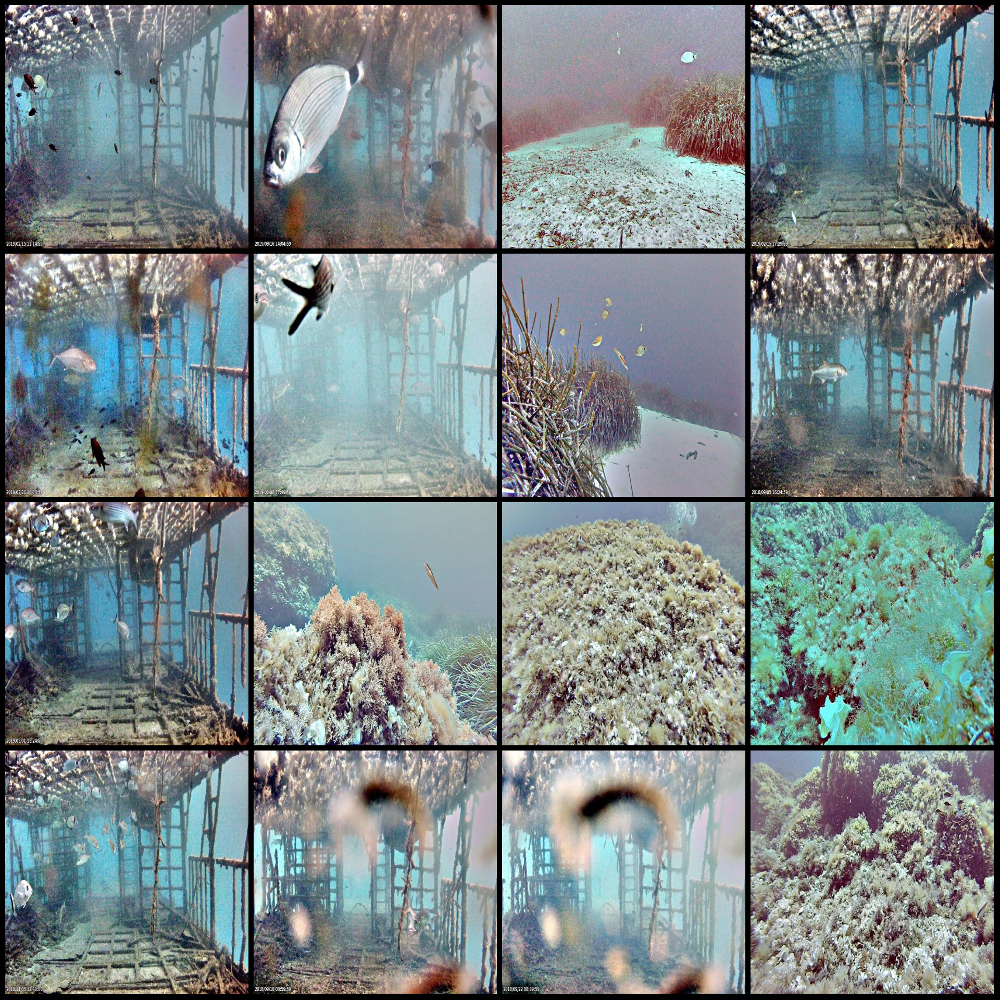
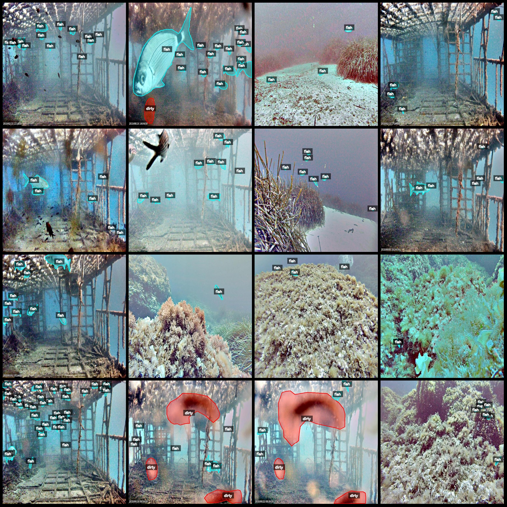
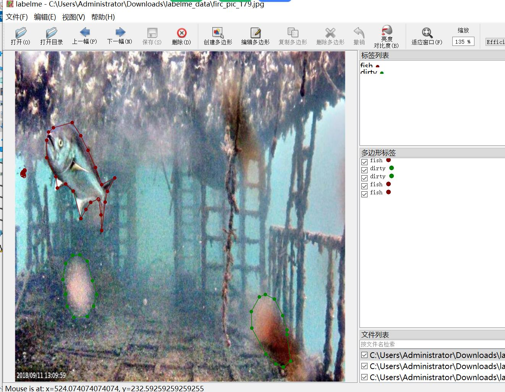

# Underwater Small Target Fish Identification and Segmentation Dataset in labelme Format: 1190 Images, 2 Categories

Dataset format: labelme format (no mask files included, only containing jpg images and corresponding json files)
Number of images (number of jpg files): 1190
Number of annotations (number of json files): 1190
Number of categories: 2
Annotation category names: ["dirty", "fish"]
Number of boxes for each category:
- dirty count = 724
- fish count = 12246
Total boxes: 12970
Labelme version used: labelme=5.5.0
Image resolution: 640x640
Annotation rules: Polygons are drawn to the categories
Important note: The dataset can be edited using labelme, but the json dataset needs to be converted into either mask or yolo format or coco format for semantic segmentation or instance segmentation.
Special declaration: This dataset does not guarantee the accuracy of the trained models or weight files.
Image preview:
Annotation example:
Randomly selected 16 images:
Annotation drawing results:
Labelme editing image examples:

## Images

Here is a pay link on Stripe ( https://buy.stripe.com/3cs8yP7sY87d0vu9AB ). Please contact me lonlonago@foxmail.com after funding $89, and I will send you a complete data files , thank you!

